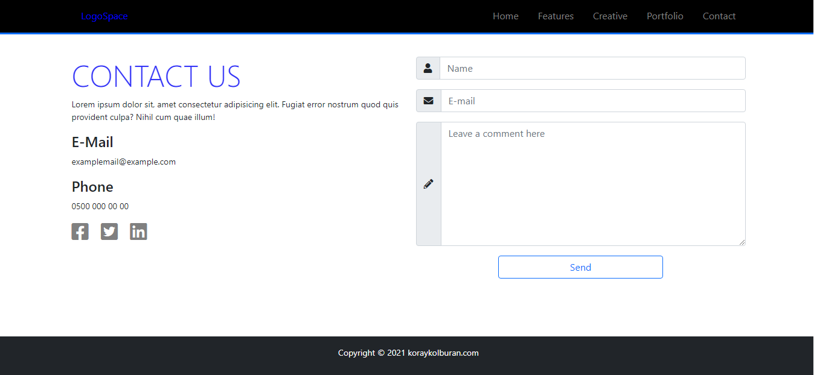

# homework5-responsive-Bootstrap5
I've made responsive web page with Bootstrap5 that named 'LogoSpace'. (This is bootcamp homework about advanced bootstrap5)

> > [LinkedIn](https://www.linkedin.com/in/koray-kolburan/)
> >  
> > [github](https://github.com/koraykolburan)

 ### Screenshots about homework!
  
  
  
  
  
